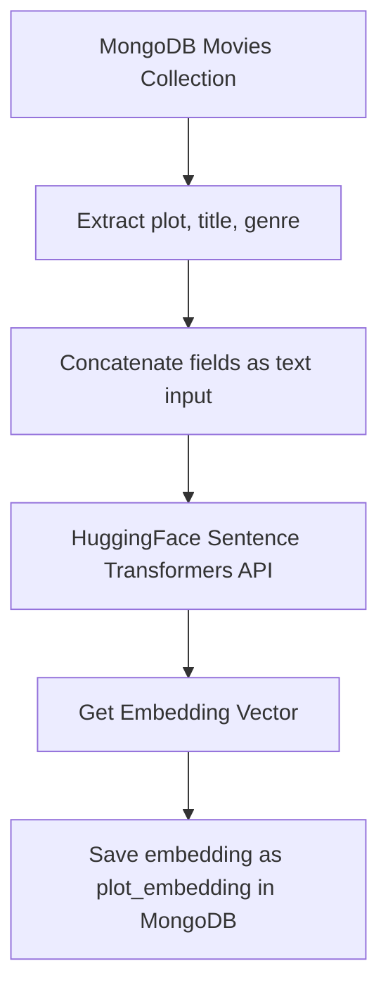
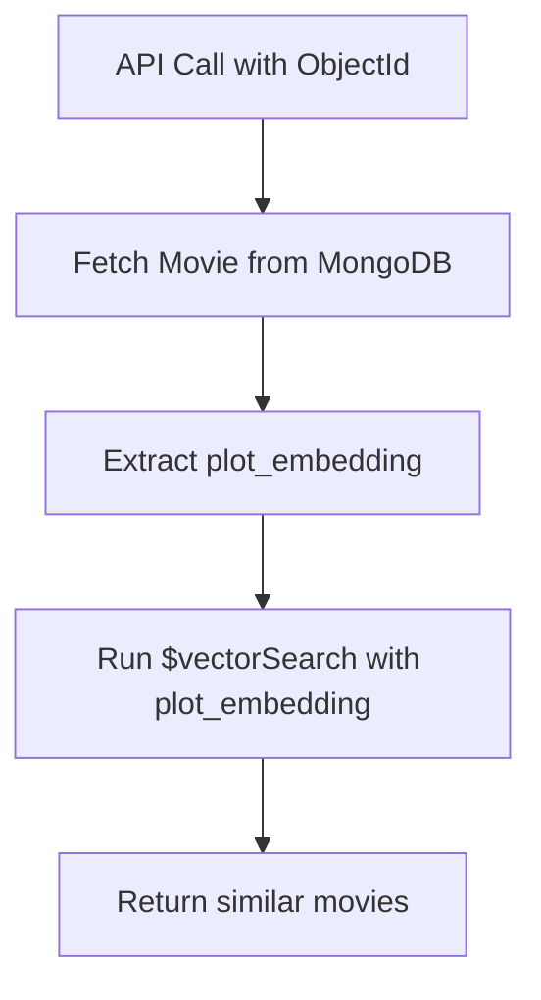
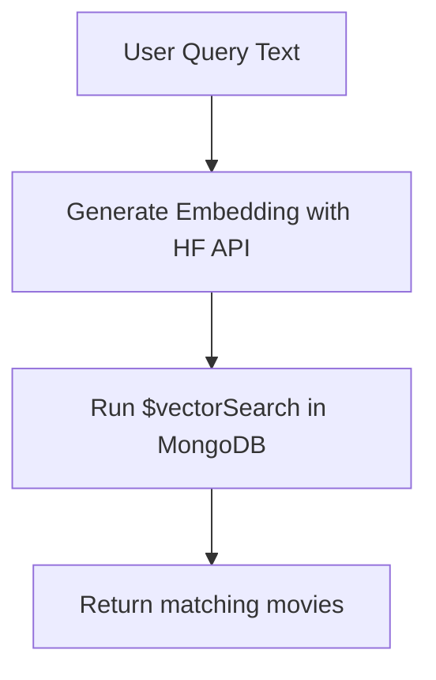

# 🎬 AI Movie Recommendation System - System Design

## 🧠 Embedding Generation Pipeline

### 🔹 Step 1: Fetch Data

* Retrieve movie documents from MongoDB.
* Extract the following fields from each movie:

  * `plot`
  * `title`
  * `genre`

### 🔹 Step 2: Generate Embeddings

* Combine the extracted fields into a single string.
* Use **HuggingFace Sentence Transformers API** to generate embeddings.
* HuggingFace API is accessed using an authentication token.

### 🔹 Step 3: Store Embeddings

* Store the generated vector in a new key `plot_embedding` within the same document in MongoDB.
* This key is used later for similarity search.

### 📊 Embedding Flow Diagram

---

## 🎯 Recommendation by Movie ID

### 🔹 Step 1: Get Target Movie

* Receive a request with a specific movie's MongoDB `ObjectId`.
* Fetch the movie and its `plot_embedding`.

### 🔹 Step 2: Vector Similarity Search

* Perform vector similarity search using MongoDB's `$vectorSearch` on the `plot_embedding` field.
* Retrieve movies with the most similar vectors.

### 🔹 Step 3: Return Result

* Return a list of top N similar movies to the user.

### 📊 Recommendation by ID Flow

---

## 🔍 Embedding-Based Text Search

### 🔹 Step 1: Handle User Query

* Accept a text input query (e.g., "thrilling space adventure").
* Generate an embedding for the text using the same HuggingFace model.

### 🔹 Step 2: Run Vector Search

* Use the query embedding to perform `$vectorSearch` on the `plot_embedding` field in MongoDB.

### 🔹 Step 3: Return Matches

* Return the most similar movie documents based on vector distance.

### 📊 Text Search Flow

